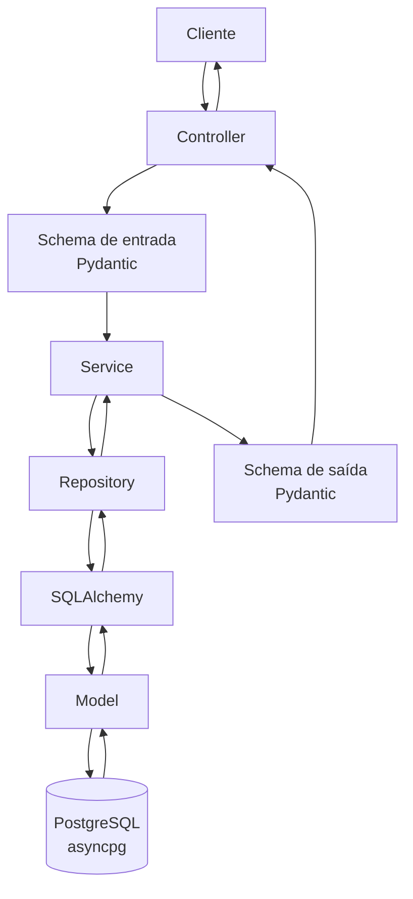

# Arquitetura do Backend

## Introdução

O backend do projeto (API e serviço de autenticação) foi desenvolvido em **Python 3.12**, utilizando o framework **FastAPI** para a construção da API e o banco de dados **PostgreSQL** para persistência das informações.

O projeto é gerenciado com **Poetry**, possui suporte a migrações com **Alembic**, acesso ao banco com **SQLAlchemy** e comunicação assíncrona com PostgreSQL por meio do driver **asyncpg**.

A organização interna segue uma arquitetura **MVC em camadas**, separando responsabilidades entre controllers, services, repositories, models e schemas. Essa divisão facilita a manutenção do código, melhora a testabilidade e permite que novas funcionalidades sejam adicionadas sem acoplamento excessivo entre regras de negócio, validação de dados e acesso ao banco.

## Visão Geral da Arquitetura

A arquitetura adotada organiza o backend em camadas com responsabilidades bem definidas:

- **Controller:** camada responsável por expor os endpoints HTTP da API.
- **Service:** camada responsável por concentrar as regras de negócio da aplicação.
- **Repository:** camada responsável por intermediar o acesso ao banco de dados.
- **Model:** camada responsável por representar as entidades persistidas no PostgreSQL.
- **Schema:** camada responsável por validar e estruturar os dados de entrada e saída com Pydantic.

O fluxo principal de uma requisição ocorre da seguinte forma:

## Padrão MVC em Camadas

O projeto utiliza o padrão MVC adaptado para uma API backend. Nesse contexto, a separação entre as responsabilidades não está ligada diretamente a telas ou interfaces gráficas, mas ao fluxo de dados e regras da aplicação.

### Models

Os **models** representam as entidades principais do domínio e sua estrutura de persistência no banco de dados PostgreSQL.

Essa camada é responsável por definir como os dados são armazenados, quais atributos fazem parte de cada entidade e como essas entidades se relacionam. No projeto, essa representação é apoiada pelo **SQLAlchemy**, que fornece a camada ORM para mapear entidades Python para tabelas relacionais. Os models não devem concentrar regras de negócio complexas, mantendo o foco na representação dos dados persistidos.

### Schemas

Os **schemas** são definidos com **Pydantic** e utilizados para validar os dados recebidos e retornados pela API.

Eles garantem que as entradas tenham o formato esperado antes de chegarem às regras de negócio e que as respostas sejam padronizadas antes de serem enviadas ao cliente. Com isso, a API reduz erros de tipagem, evita dados incompletos e mantém contratos claros entre backend e consumidores da aplicação.

Os schemas são utilizados principalmente para:

- validar payloads recebidos nos endpoints;
- definir campos obrigatórios e opcionais;
- serializar respostas da API;
- documentar automaticamente os contratos da API no FastAPI;
- separar os dados expostos externamente dos dados persistidos internamente.

### Controllers

Os **controllers** representam a camada de entrada da aplicação. No FastAPI, essa responsabilidade é normalmente implementada por rotas e routers.

Essa camada recebe as requisições HTTP, aplica os schemas de entrada, delega a execução das regras de negócio para os services e retorna a resposta adequada ao cliente. Os controllers devem permanecer simples, evitando conter regras de negócio ou lógica de acesso direto ao banco.

Principais responsabilidades dos controllers:

- declarar endpoints da API;
- receber parâmetros de rota, query e corpo da requisição;
- acionar os services correspondentes;
- definir status codes e respostas HTTP;
- retornar dados validados por schemas de saída.

### Services

Os **services** concentram as regras de negócio da aplicação.

Essa camada coordena as operações necessárias para executar um caso de uso, validando regras específicas do domínio, chamando repositories quando é necessário consultar ou persistir dados e preparando o resultado para retorno ao controller.

Ao manter as regras de negócio nos services, o projeto evita que controllers fiquem sobrecarregados e impede que repositories passem a conhecer decisões de negócio que não pertencem à camada de persistência.

### Repositories

Os **repositories** isolam a comunicação com o banco de dados PostgreSQL.

Essa camada é responsável por executar consultas, criar registros, atualizar informações, remover dados e recuperar entidades persistidas. O objetivo é evitar que a lógica de acesso ao banco fique espalhada pela aplicação.

Com o uso de repositories, os services dependem de métodos de persistência bem definidos, sem precisar conhecer detalhes das queries ou da implementação do banco.

## Banco de Dados

O banco de dados utilizado no backend é o **PostgreSQL**.

A aplicação utiliza o banco para persistir as informações manipuladas pela API, mantendo a camada de acesso aos dados centralizada nos repositories e a representação das entidades nos models. Essa separação permite evoluir o modelo de dados de forma mais controlada e reduz o impacto de mudanças na persistência sobre as demais camadas da aplicação.

O acesso ao banco é realizado com **SQLAlchemy 2**, enquanto o driver **asyncpg** permite a comunicação assíncrona com o PostgreSQL. As alterações estruturais no banco são versionadas com **Alembic**, garantindo controle sobre a evolução das tabelas, colunas, índices e relacionamentos.

## Validação de Dados com Pydantic

O uso do **Pydantic** é essencial para a confiabilidade da API.

No backend, os schemas Pydantic validam tanto as entradas quanto as saídas dos endpoints. Isso significa que os dados recebidos de clientes externos são conferidos antes de serem processados, e os dados retornados pela aplicação seguem uma estrutura previsível.

Essa abordagem contribui para:

- maior segurança no processamento das requisições;
- redução de erros causados por dados inválidos;
- documentação automática dos contratos da API;
- padronização das respostas;
- separação entre dados internos da aplicação e dados expostos pela API.

Além dos schemas de entrada e saída, o projeto utiliza **Pydantic Settings** para organizar configurações da aplicação, como variáveis de ambiente, credenciais e parâmetros de conexão.

## Autenticação e Segurança

O backend possui dependências voltadas para autenticação, validação e segurança das credenciais dos usuários.

- **python-jose:** utilizado para operações relacionadas a tokens, como JWT.
- **bcrypt:** utilizado para hash e verificação de senhas.
- **email-validator:** utilizado para validação de campos de e-mail recebidos pela API.

Essas dependências apoiam a implementação de fluxos de autenticação seguros e ajudam a manter a consistência dos dados recebidos nos endpoints.

## Qualidade de Código

Para manter a padronização e a qualidade do código, o projeto utiliza o **Ruff** como linter na versão **0.15.9**.

O Ruff é responsável por identificar problemas de estilo, imports não utilizados, inconsistências e possíveis más práticas no código Python. Sua adoção contribui para uma base de código mais consistente, legível e fácil de manter pela equipe.

A configuração do Ruff define limite de **99 caracteres por linha**, exclui a pasta de migrações da análise e habilita regras voltadas para imports, erros de código, estilo, PyLint, Pytest e FastAPI. O formatador do Ruff utiliza aspas simples e indentação com tabulação, mantendo a padronização definida para o projeto.

## Testes e Automação

O projeto possui dependências de desenvolvimento voltadas para testes automatizados e validação da API.

- **pytest:** execução da suíte de testes.
- **pytest-cov:** geração de relatórios de cobertura.
- **pytest-asyncio:** suporte a testes assíncronos.
- **httpx:** testes de chamadas HTTP.
- **testcontainers[postgres]:** criação de ambientes de teste com PostgreSQL em container.
- **taskipy:** automação de comandos recorrentes do projeto.

Os comandos de automação incluem execução do linter, formatação, inicialização local da API com Uvicorn, aplicação de migrações, criação de novas migrações e execução da suíte de testes com cobertura.

## Tecnologias Utilizadas

- **Python 3.12:** linguagem utilizada no desenvolvimento do backend.
- **FastAPI 0.135.x:** framework utilizado para criação da API.
- **SQLAlchemy 2:** ORM utilizado para mapeamento e acesso aos dados.
- **PostgreSQL:** banco de dados relacional utilizado para persistência.
- **asyncpg:** driver assíncrono de conexão com PostgreSQL.
- **Alembic:** ferramenta utilizada para versionamento de migrações do banco.
- **Pydantic:** biblioteca utilizada para validação e serialização de dados.
- **Pydantic Settings:** biblioteca utilizada para configuração da aplicação.
- **python-jose:** biblioteca utilizada para operações com tokens.
- **bcrypt:** biblioteca utilizada para hash de senhas.
- **Ruff 0.15.9:** linter utilizado para padronização e análise estática do código.
- **Pytest:** ferramenta utilizada para testes automatizados.
- **Taskipy:** ferramenta utilizada para automação de comandos.

## Benefícios da Arquitetura

A arquitetura MVC em camadas adotada no backend traz os seguintes benefícios para o projeto:

- **Separação de responsabilidades:** cada camada possui uma função clara dentro da aplicação.
- **Manutenibilidade:** mudanças em regras de negócio, validações ou persistência podem ser realizadas de forma mais localizada.
- **Testabilidade:** services, repositories e controllers podem ser testados de maneira mais isolada.
- **Escalabilidade:** novas funcionalidades podem ser adicionadas seguindo o mesmo padrão estrutural.
- **Padronização:** a equipe consegue manter uma organização consistente ao longo do desenvolvimento.
- **Confiabilidade:** o uso de schemas Pydantic reduz a entrada e saída de dados inválidos.

## Histórico de Versões

- **1.0:** Criação da documentação da arquitetura do backend. Autor: [Lucas Guimarães](https://github.com/lcsgborges). Data: 26/05/2026.
- **1.1:** Atualização da stack técnica com base no pyproject do backend. Autor: [Lucas Guimarães](https://github.com/lcsgborges). Data: 26/05/2026.
