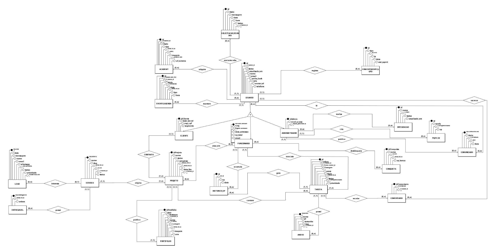
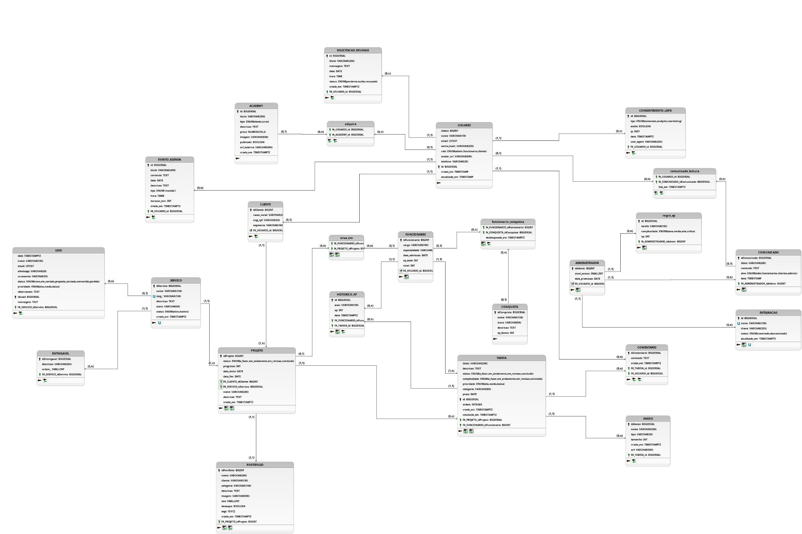

# Projeto de Banco de Dados

## Modelo Entidade-Relacionamento (ME-R)

O modelo de banco de dados da Korus foi estruturado para representar os principais
fluxos do sistema: cadastro e autenticação de usuários, contratação de serviços,
gestão de projetos, tarefas, comunicação, agenda, gamificação, consentimentos LGPD
e integrações externas.

A modelagem parte da entidade central **USUARIO**, especializada em três perfis:
**CLIENTE**, **FUNCIONARIO** e **ADMIN**. A partir desses perfis, o sistema organiza
projetos, responsabilidades, comunicados, pontuação, conquistas e registros
operacionais.

## Identificação das Entidades

- USUARIO
- CLIENTE
- FUNCIONARIO
- ADMIN
- SERVICO
- ENTREGAVEL
- LEAD
- PROJETO
- PROJETO_FUNCIONARIO
- TAREFA
- COMENTARIO
- ANEXO
- PORTFOLIO
- ACADEMY
- COMPRA_ACADEMY
- COMUNICADO
- COMUNICADO_LEITURA
- EVENTO_AGENDA
- SOLICITACAO_REUNIAO
- REGRA_XP
- HISTORICO_XP
- CONQUISTA
- FUNCIONARIO_CONQUISTA
- CONSENTIMENTO_LGPD
- INTEGRACAO

## Descrição das Entidades

Legenda: **PK** = Chave Primária · **FK** = Chave Estrangeira · **UQ** = Único.

| Entidade | Atributos |
| --- | --- |
| **USUARIO** | idUsuario **PK**, nome, email **UQ**, senha, role, avatar, telefone, status, criadoEm, atualizadoEm |
| **CLIENTE** | idCliente **PK, FK -> USUARIO.idUsuario**, razaoSocial, cnpjCpf **UQ**, segmento |
| **FUNCIONARIO** | idFuncionario **PK, FK -> USUARIO.idUsuario**, cargo, especialidade, dataAdmissao, xpTotal, nivel |
| **ADMIN** | idAdmin **PK, FK -> USUARIO.idUsuario**, nivelAcesso, dataPromocao |
| **SERVICO** | idServico **PK**, nome, slug **UQ**, descricao, icone, status, criadoEm |
| **ENTREGAVEL** | idEntregavel **PK**, descricao, ordem, idServico **FK -> SERVICO.idServico** |
| **LEAD** | idLead **PK**, nome, email, whatsapp, orcamento, status, prioridade, mensagem, data, idServico **FK -> SERVICO.idServico** |
| **PROJETO** | idProjeto **PK**, nome, descricao, status, progresso, dataInicio, dataFim, criadoEm, idCliente **FK -> CLIENTE.idCliente**, idServico **FK -> SERVICO.idServico** |
| **PROJETO_FUNCIONARIO** | idProjeto **PK, FK -> PROJETO.idProjeto**, idFuncionario **PK, FK -> FUNCIONARIO.idFuncionario**, papel, dataEntrada |
| **TAREFA** | idTarefa **PK**, titulo, descricao, status, complexidade, prioridade, categoria, prazo, ordem, criadoEm, concluidoEm, idProjeto **FK -> PROJETO.idProjeto**, idResponsavel **FK -> FUNCIONARIO.idFuncionario** |
| **COMENTARIO** | idComentario **PK**, conteudo, criadoEm, idTarefa **FK -> TAREFA.idTarefa**, idAutor **FK -> USUARIO.idUsuario** |
| **ANEXO** | idAnexo **PK**, nome, url, tipo, tamanho, criadoEm, idTarefa **FK -> TAREFA.idTarefa** |
| **PORTFOLIO** | idPortfolio **PK**, nome, cliente, categoria, descricao, imagem, ano, destaque, tags, criadoEm, idProjeto **FK -> PROJETO.idProjeto, opcional** |
| **ACADEMY** | idAcademy **PK**, titulo, tipo, descricao, preco, imagem, urlExterna, publicado, criadoEm |
| **COMPRA_ACADEMY** | idUsuario **PK, FK -> USUARIO.idUsuario**, idAcademy **PK, FK -> ACADEMY.idAcademy**, valorPago, status, compradoEm |
| **COMUNICADO** | idComunicado **PK**, titulo, conteudo, alvo, data, idAdmin **FK -> ADMIN.idAdmin** |
| **COMUNICADO_LEITURA** | idComunicado **PK, FK -> COMUNICADO.idComunicado**, idUsuario **PK, FK -> USUARIO.idUsuario**, lidoEm |
| **EVENTO_AGENDA** | idEvento **PK**, titulo, descricao, tipo, data, hora, duracaoMin, criadoEm, idUsuario **FK -> USUARIO.idUsuario** |
| **SOLICITACAO_REUNIAO** | idSolicitacao **PK**, titulo, mensagem, data, hora, status, criadoEm, idRemetente **FK -> USUARIO.idUsuario**, idDestinatario **FK -> USUARIO.idUsuario** |
| **REGRA_XP** | idRegra **PK**, tarefa, complexidade, xp, idAdmin **FK -> ADMIN.idAdmin, opcional** |
| **HISTORICO_XP** | idHistorico **PK**, acao, xp, data, idFuncionario **FK -> FUNCIONARIO.idFuncionario**, idTarefa **FK -> TAREFA.idTarefa, opcional**, idRegra **FK -> REGRA_XP.idRegra, opcional** |
| **CONQUISTA** | idConquista **PK**, nome, icone, descricao, xpBonus |
| **FUNCIONARIO_CONQUISTA** | idFuncionario **PK, FK -> FUNCIONARIO.idFuncionario**, idConquista **PK, FK -> CONQUISTA.idConquista**, desbloqueadoEm |
| **CONSENTIMENTO_LGPD** | idConsentimento **PK**, tipo, aceito, ip, userAgent, data, idUsuario **FK -> USUARIO.idUsuario, opcional** |
| **INTEGRACAO** | idIntegracao **PK**, nome, chave, status, atualizadoEm |

## Descrição dos Relacionamentos

| Relacionamento | Descrição | Cardinalidade |
| --- | --- | --- |
| USUARIO especializa CLIENTE / FUNCIONARIO / ADMIN | Cada usuário do sistema é classificado como cliente, funcionário ou administrador, e cada especialização corresponde a um único usuário. | 1:1 |
| CLIENTE contrata PROJETO | Um cliente pode contratar vários projetos e cada projeto é contratado por apenas um cliente. | 1:N |
| SERVICO origina PROJETO | Cada projeto é executado a partir de um serviço do catálogo e um mesmo serviço pode dar origem a vários projetos. | 1:N |
| SERVICO possui ENTREGAVEL | Um serviço possui vários entregáveis previstos e cada entregável pertence a um único serviço. | 1:N |
| SERVICO interessa LEAD | Um lead manifesta interesse em um serviço específico e um mesmo serviço pode ser solicitado por vários leads. | 1:N |
| FUNCIONARIO atua_em PROJETO | Um funcionário pode atuar em vários projetos e um projeto envolve vários funcionários como equipe responsável. | N:M |
| PROJETO contém TAREFA | Um projeto contém várias tarefas no quadro Kanban e cada tarefa pertence a um único projeto. | 1:N |
| FUNCIONARIO executa TAREFA | Um funcionário pode ser responsável por várias tarefas e cada tarefa tem um único funcionário responsável pela execução. | 1:N |
| TAREFA recebe COMENTARIO | Uma tarefa pode receber vários comentários e cada comentário está vinculado a uma única tarefa. | 1:N |
| TAREFA possui ANEXO | Uma tarefa pode possuir vários anexos e cada anexo pertence a uma única tarefa. | 1:N |
| USUARIO escreve COMENTARIO | Um usuário pode escrever vários comentários e cada comentário tem um único autor. | 1:N |
| PROJETO publica PORTFOLIO | Um projeto pode dar origem a um item público no portfólio e cada item do portfólio referencia opcionalmente um projeto realizado. | 1:1 opcional |
| USUARIO adquire ACADEMY | Um usuário pode adquirir vários conteúdos da Academy e um mesmo conteúdo pode ser adquirido por vários usuários. | N:M |
| ADMIN publica COMUNICADO | Um administrador pode publicar vários comunicados e cada comunicado é publicado por um único administrador. | 1:N |
| USUARIO lê COMUNICADO | Um usuário pode ler vários comunicados e um comunicado pode ser lido por vários usuários. | N:M |
| USUARIO mantém EVENTO_AGENDA | Cada usuário possui sua agenda particular com vários eventos e cada evento pertence a um único usuário. | 1:N |
| USUARIO envia/recebe SOLICITACAO_REUNIAO | Um usuário pode enviar e receber várias solicitações de reunião, e cada solicitação envolve exatamente um remetente e um destinatário. | 1:N em cada papel |
| FUNCIONARIO acumula HISTORICO_XP | Um funcionário acumula vários registros de pontuação ao longo do tempo e cada registro pertence a um único funcionário. | 1:N |
| TAREFA gera HISTORICO_XP | Uma tarefa concluída pode gerar registros de XP e cada registro está associado a no máximo uma tarefa. | 1:N |
| ADMIN cria REGRA_XP | Cada regra de XP pode ser criada por um administrador e cada administrador pode criar uma ou mais regras. | 1:N |
| FUNCIONARIO desbloqueia CONQUISTA | Um funcionário pode desbloquear várias conquistas e uma mesma conquista pode ser desbloqueada por vários funcionários. | N:M |
| USUARIO registra CONSENTIMENTO_LGPD | Um usuário registra vários consentimentos ao longo do tempo e cada registro pode pertencer a um usuário ou visitante anônimo. | 1:N |

## Diagrama Entidade-Relacionamento (DE-R)

## Diagrama Lógico de Dados (DLD)

## Observações da Modelagem

- A especialização de **USUARIO** em **CLIENTE**, **FUNCIONARIO** e **ADMIN** deve ser
  controlada pela regra de negócio do sistema, garantindo que cada usuário esteja
  associado ao perfil correto.
- O relacionamento **FUNCIONARIO atua_em PROJETO** foi materializado pela tabela
  associativa **PROJETO_FUNCIONARIO**.
- O relacionamento **USUARIO adquire ACADEMY** foi materializado pela tabela
  associativa **COMPRA_ACADEMY**, pois se trata de uma relação N:M.
- O relacionamento **USUARIO lê COMUNICADO** foi materializado pela tabela
  associativa **COMUNICADO_LEITURA**, permitindo registrar quando cada usuário leu
  cada comunicado.
- O relacionamento **FUNCIONARIO desbloqueia CONQUISTA** foi materializado pela
  tabela associativa **FUNCIONARIO_CONQUISTA**.
- A entidade **CONSENTIMENTO_LGPD** permite `idUsuario` opcional para registrar
  consentimentos de visitantes anônimos antes do login.
- A entidade **INTEGRACAO** foi mantida independente, pois representa configurações
  externas do sistema e não depende diretamente de uma entidade operacional.

## Histórico de Versões

| Versão | Descrição | Autor(es) | Data | Revisor(es) | Data de revisão |
| ------ | --------- | --------- | ---- | ----------- | --------------- |
| 1.0 | Criação da documentação sobre a modelagem do banco de dados | [Gabriel Lopes](https://github.com/BrzGab) | 26/05/2026 | [Artur Mendonça](https://github.com/ArtyMend07) | 26/05/2026 |