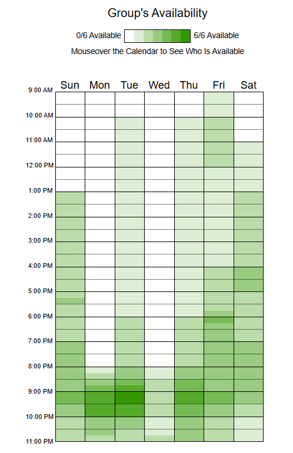

# Disponibilidade da Equipe

Este documento registra a análise da sobreposição de horários livres de todos os membros da equipe, baseada no Heatmap de Disponibilidade. O objetivo é definir o melhor horário para as nossas reuniões semanais.

## 1. Análise do Heatmap

De acordo com o heatmap preenchido pela equipe completa (5 membros + 1 stakeholder), o único horário que atinge a disponibilidade total de todos os membros é:

- **Terça-feira, às 21:00**

## 2. Horário de Reunião

Com base nestes dados e no alinhamento final da equipe, o horário combinado e formalizado para as reuniões recorrentes é:

- **Dia:** Terça-feira  
- **Horário:** 21:00  

Este horário atende a todos os membros da equipe e proporciona um ponto de encontro estável para os encontros semanais.

---
## Histórico de Versões
| Versão | Descrição | Autor(es) | Data | Revisor(es) | Data de Revisão |
|--------|-----------|-----------|------|-------------|-----------------|
| 1.0 | Criação do documento de disponibilidade da equipe e definição do horário estrutural. | [Artur Mendonça Arruda](https://github.com/ArtyMend07) | 12/04/2026 | - | - |
| 1.1 | Atualização destacando o pico absoluto de 6 membros na terça-feira | [Artur Mendonça Arruda](https://github.com/ArtyMend07) | 12/04/2026 | - | - |
