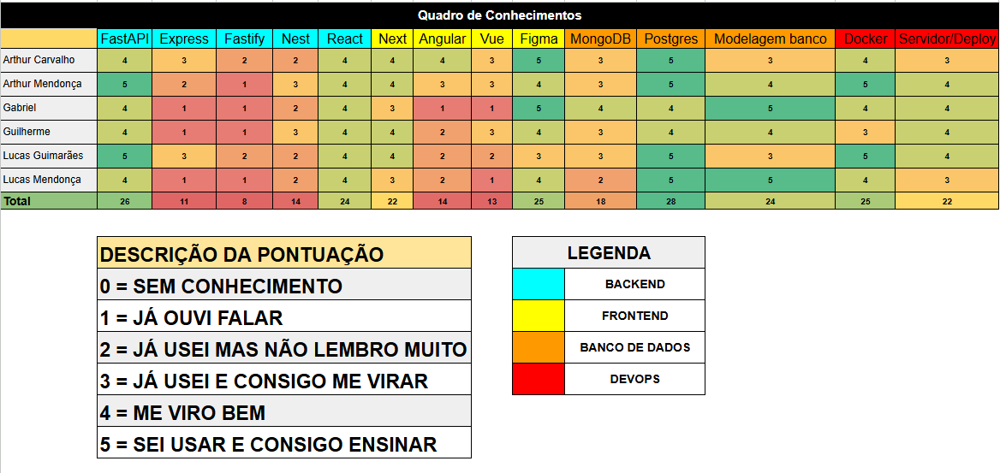

# Matriz de Competências

Este documento apresenta a Matriz de Competências da equipe. O levantamento mede o nível de domínio individual de cada membro sobre as tecnologias selecionadas, pontuando de 0 a 5.

## 1. Mapeamento de Tecnologias

A tabela divide as disciplinas nas seguintes frentes arquiteturais:
- **Backend:** FastAPI, Express, Fastify, Nest
- **Frontend:** React, Next, Angular, Vue, Figma
- **Banco de Dados:** MongoDB, Postgres, Modelagem de Banco
- **DevOps:** Docker, Servidor/Deploy

## 2. Análise Técnica e Domínio da Equipe

Com base na somatória dos conhecimentos formados pelos seis desenvolvedores, observa-se que as maiores proficiências técnicas globais do grupo encontram-se em:
- **Postgres** (28 pontos)
- **FastAPI** (26 pontos)
- **Figma** (25 pontos)
- **Docker** (25 pontos)
- **React** (24 pontos) e **Modelagem** (24 pontos)

Por contrapartida, as áreas de maior risco técnico e menor nivelamento histórico concentram-se em: **Fastify** (8), **Express** (11) e **Vue** (13).

Esta métrica dita a viabilidade técnica na alocação de pareamentos e na escolha da stack definitiva para o projeto.

---
## Histórico de Versões
| Versão | Descrição | Autor(es) | Data | Revisor(es) | Data de Revisão |
|--------|-----------|-----------|------|-------------|-----------------|
| 1.0 | Criação inicial do documento e consolidação da matriz de competências técnicas. | [Artur Mendonça Arruda](https://github.com/ArtyMend07) | 12/04/2026 | - | - |
